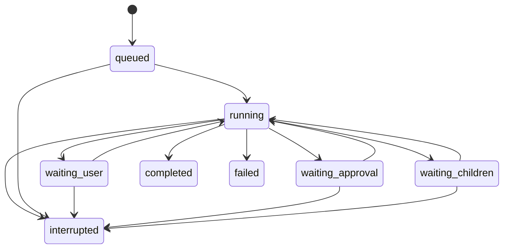

# Architecture

## Boundaries

- `shared/`: domain and wire types.
- `server/core/`: lifecycle, model concurrency, orchestration and generic prompts.
- `server/providers/`: protocol-specific serialization, streaming, usage and model discovery. No UI or filesystem execution dependencies.
- `server/tools/`: validated tool registry and capability checks; a tool declaration is separate from its implementation.
- `server/services/`: file access, process execution, approvals, document extraction, retrieval, embeddings, skills and MCP.
- `server/storage/`: SQLite records, ordered events, effects and metering ledger.
- `server/http/`: loopback authenticated API and SSE.
- `src/`: React UI; model credentials never enter public state.
  Sanitized regression tests and CI are public; local credentials, conversations and live-test artifacts are excluded.

The runtime receives a model-provider resolver, making it replaceable in tests. Its tool context contains explicit service ports. Provider-specific reasoning blocks live in model messages, not tool execution code. Subagents reuse the same runtime and shared model pool; they do not create a second orchestration engine.

## Planning and environment boundary

RunEnvironment resolves file scope and constructs model context through explicit store, settings and memory-recall dependencies. It cannot schedule, call providers or mutate execution controllers. Runtime still owns the run lifecycle; this is an incremental separation, not elimination of all orchestration coupling.

Task proposals pass through a typed plan compiler before reaching the board. Scheduling records attributed outcomes and can apply bounded empirical feedback after enough same-scope/model/specialization samples. See [planning and routing](PLANNING-AND-ROUTING.md) for cold-start behavior and evidence limitations.

## Run lifecycle

Terminal runs are immutable lifecycle endpoints. Continuing creates a new run using the last durable context. A service restart never resumes model or tool work automatically.

## Ordered evidence

User messages, assistant messages, tool starts/results, approvals, usage and status changes are persisted as ordered events. Token deltas are ephemeral for efficient streaming; finalized text is durable. An interrupted partial answer is saved with an incomplete marker.

Side-effect intent is recorded before file writes and commands. Completion is recorded afterwards. Missing results remain unknown. Uncertain effects remain visible for inspection; read-only continuation is possible, but uncertain side effects are not automatically replayed.

This does not provide distributed exactly-once execution. A process can fail between a tool's real effect and its durable result. The ledger exposes that ambiguity.

## Context and delegation

Compaction summarizes complete historical message groups while keeping recent tool-call/result pairs intact. The threshold is calibrated from measured API usage when available, with an explicit local fallback. Usage is metered for compaction requests too.

Children receive a narrow task and deliverable, project facts, selected skills and authorized knowledge scopes. They do not inherit the complete author transcript. Read-only workers remain the default. Writable workers get isolated folder copies and require explicit versioned integration; child commands require an OS isolation backend and external MCP remains disabled. Wait cycles are rejected; cancellation follows descendants.

The parent cannot become terminal with live direct children. Model concurrency is enforced at request admission, including resumed and compaction requests.

## Extension points and remaining work

Use the provider interface for additional protocols, the tool registry for capabilities, and dedicated services for infrastructure. Do not add provider-specific branches to the tool loop.

AppContainer adapters, isolated writable copies and worker-based HNSW are described in MIGRATION.md. ANN now persists content-keyed, checksum-validated native indexes and calibrates sampled neighbor recall against exact search. Remaining work includes broader retrieval-quality evaluation, stronger migration/versioning, cross-platform credential vault integration and comparative unseen-task evaluation.

## Runtime service boundaries

Runtime coordinates run lifecycle and model turns. ContextManager owns compaction with injected model/storage ports. ToolExecutor owns the effect journal, spill and checkpoint delivery; executeBatch implements bounded observational concurrency with serial mutation barriers. DelegationManager owns run-tree scope, child limits, wait-cycle prevention and isolated-copy integration through a small host interface.

Only audited file-read tools overlap, at most four per batch. Network, retrieval-index mutation, commands, approvals, coordination and writes remain serial. Started reads settle before cancellation/failure unwinds; successful tool messages commit in declared call order. This is not arbitrary dependency inference.

TaskBoard is an optional durable DAG: the lead creates a plan; workers claim ready tasks using optimistic revisions. Owners or lead update tasks, and done requires successful tool-result event references from the same tree. Evidence references prove provenance, not semantic correctness or independent review. A task run cannot report completed with its declared plan unfinished. Plans do not grant file ownership or bypass isolated merging.

Memory recall filters confirmation, expiration and project scope before relevance ranking and deduplication, with a bounded prompt allocation. Semantic indexing is an explicit user action which sends confirmed memory text to the configured embedding provider. Index entries bind content revision/scope and model fingerprint. Recall uses semantic similarity when a valid index is available, otherwise lexical relevance; deleted or changed entries are rechecked after network requests. Similarity does not resolve contradictions or prove truth.

Storage retains JSON domain records for local compatibility, with a versioned schema migration marker and indexed per-conversation run lookup. This is not a multi-tenant or distributed store.

Protocol repair permits one additional model request per run for rejected malformed arguments or duplicate call IDs. No tools from the rejected response have executed. Both requests are accounted; authentication failures, ambiguous execution and arbitrary command failures are not replayed.

## Version-bound observations and team handoff

Plans may declare artifact paths. For read_file and run_command, the host hashes declared files before and after execution (4 MB per file, 16 MB per observation). record_verification accepts only an existing successful observation with matching workspace identity and unchanged declared files; a file read must address the declared path. Command success is an observed zero exit code, not a proof of the acceptance criterion. Missing, oversized or inaccessible files cannot be certified.

Verification has three user-facing meanings: author-reported (no binding), checked (observed result bound to a version), and stale. inspect_plan and run finalization recheck bound versions; stale records block completion. This is point-in-time validation, not a filesystem lock, adversarial TOCTOU protection, full dependency discovery or independent semantic review. Snapshots now expand declared read paths, recognized local JS/TS imports and root dependency manifests. Dynamic imports, build-system resolution, excluded dependency/build directories and other undeclared inputs are not fully covered. Isolated-copy evidence cannot certify the parent copy after merge; recheck in the destination.

inspect_team exposes same-root members, statuses, task ownership and handoff history. Lead-only handoff_task reassigns an unfinished task using an optimistic board revision. The old owner and descendants must be terminal and free of unknown effects; the target must be an active same-team member. It clears old evidence, records the transfer and attempts a steering notification, reporting whether delivery was queued. It does not start workers, grant permissions, copy files or replay operations. Scheduling and selection remain model-directed. Boards are scoped to a run tree, not automatically inherited by a new top-level run.

## October 2026 routing and runtime boundaries

- Task contracts distinguish sourced existing inputs from provided/required outputs; the host derives dependencies and rejects missing producers, ambiguity and cycles.
- File read/write hints prevent conflicting assignments. These are planning hints, never an OS isolation boundary.
- Worker skills/path ownership and word overlap supplement capacity. Only checked completion evidence contributes positively to team-local history; blocked relevant work reduces the score. This is bounded heuristic adaptation, not trained scheduling or code-semantic analysis.
- Existing task weight remains an explicit effort/capacity estimate. No hidden token budget is introduced.
- Dependent writable tasks still require lead-managed refreshed copies; automatic assignment refuses stale-copy risks.
- TeamCoordinator owns dispatch and event waits through a narrow port. finalizeRun owns host completion checks. ToolExecutor, ContextManager and DelegationManager retain separate responsibilities. Runtime remains the composition root and model-loop coordinator; RunPump now owns execution queue, per-conversation capacity, cancellation and shutdown draining through a narrow port. Recovery policy and lifecycle coordination still remain partly in Runtime.
- Still unproven: optimal delegation, cross-project learning, unseen-task quality/cost superiority. One live planning probe cannot establish these.

The public planning comparison lives in evals/planning. It grades real model proposals against authored DAG expectations without executing generated work. This is planning-protocol evidence, not end-to-end task success or proof that heuristic worker ranking improves throughput.

### Persistent delegated members

A delegated conversation is a stable member (agentId); each activation has a
separate runId. list_agents discovers direct members from prior parent turns,
continue_agent starts an idle member with its retained checkpoints, and
close_agent archives an idle member without deleting history. Idle members
make no model calls. Normal compaction still applies, so retained context is
not an exact or infallible memory store. Private histories are not broadcast.

Continuation requires direct delegation provenance (a user fork is not a member),
matching project/recorded workspace roots, enabled delegation, depth/call capacity,
and no active descendants, pending background commands or unknown effects.
Current parent knowledge/skill/model policies are applied without promoting a
read-only member. Writable members retain a ready isolated copy; after a successful
merge they receive a fresh copy. Merging still requires explicit approval and
version checks. No interrupted operations are automatically replayed.
Continuation receipts use the same crash reconciliation as spawn receipts.

Team rosters and boards remain run-scoped: continue members first, then configure
the new team with the returned current run IDs and current coordinator run ID.
This preserves member continuity, not a cross-run migration of old task-board
ownership or completed approvals.

### Context reuse and trajectory intervention

The fixed instruction prefix is separated from a per-activation runtime snapshot.
The snapshot is contextual data, not an authorization grant; access enforcement
continues in host tools. Compaction preserves the latest snapshot and latest real
user request verbatim. Tool schemas are not pruned by an opaque relevance score.

Successful text-only read_file/read_skill_file/list_files results of at least
1,024 characters may use an exact-result reference when the full result of the
same operation remains in the recent context. Reads still execute and audit events
retain the returned output. Changed file reads may use a verified unified diff against a retained full base,
only when it is substantially smaller. Images, errors, commands and spilled
outputs are not deduplicated. When compaction removes the reference target, the
retained result is expanded before committing the compacted checkpoint.
context.result_reused records saved characters, not estimated billing savings.

Four repeated identical trajectories first emit a corrective observation. A second
repeated cycle stops the run; new user input resets this monitor. This is a bounded
repetition detector, not a general measure of confidence, semantic progress or plan
drift. Host permissions, effects and finalization are not controlled by it.

A two-request synthetic deepseek-flash check on 2026-10-03 returned the correct
target in both variants: full input 2,918 tokens (0 cached), short-reference input
1,584 tokens (1,408 cached), output 4 tokens each. This demonstrates this fixture,
not a general savings rate or a guaranteed provider cache hit. Client code neither
stores provider KV tensors nor reuses model answers for stateful tasks.

Further work includes richer semantic decision snapshots, optional per-component
context allocation policies and held-out end-to-end evaluations.
Tianshu-harness's convergence detector is a useful comparison for observation-led
interventions, but its composite scores and reported cache rates are not evidence
of AgentDemo performance. No Tianshu code was copied into this implementation.

### Cognitive control plane (bounded first version)

CognitiveController adapts runtime observations to the pure cognitivePolicy
reducer. Per-run persisted state contains a bounded trajectory fingerprint window,
tool-error streak, task-board completion changes, blocked task IDs and pending or
stale verification. Context pressure records the existing context estimator and
threshold; ContextManager remains the only compaction authority.

The policy proposes change-strategy, diagnose-blocker, review-plan or verify
advice. Repeating the same unchanged cycle after warning can stop the current run.
Advice has a four-batch cooldown and bounded condition deduplication. New user
input resets observations, and observed task-board advancement clears a repetition
warning. Signals are observations, not proof of semantic progress: confidence and
semantic drift remain unknown rather than fabricated scores.

The policy has no filesystem, command, permission or approval ports. Advice cannot
change authorization, replay an operation or satisfy final verification. Durable
cognitive.observed and cognitive.intervention events record decisions; the latter
appears in the collapsible execution activity in English or Chinese. Human/approval
waits do not count as failed tool batches. Commands with observed nonzero exit,
timeout or cancellation count as failures; JSON read from files does not.

This does not implement autonomous semantic replanning, learned intervention
selection, counterfactual evaluation or a general confidence estimator. Those
require separate task-level evaluation; adding more intervention prompts is not
evidence of improved autonomous success.

### Cache integrity and control feedback

Fresh changed file reads can use an exact unified patch against a full source still
in the checkpoint. Argument keys are canonicalized; folder/path/range differences
remain distinct. Deltas never chain, must reproduce the current read exactly and
must be less than 65% of the full result. On compaction, detached references are
restored with patch and result-hash verification. Local restoration metadata is
excluded from model-context estimates and provider payloads.

Compaction also receives an independently constructed host task snapshot through
an injected port: current board revision, states, dependencies, verification status
and unknown-effect identifiers. It prioritizes unfinished tasks and explicitly
counts omitted entries. It is not a substitute for the full acceptance contract.

The context inspector shows provider-reported cache usage, model/system/tool
prefix changes and component character counts. Observations persist hashes rather
than raw prompts in the prefix index. Prefix diagnostics are conversation-scoped;
a changed prefix is not proof of a cache miss, and an unchanged prefix is not a
promise of a hit. No model responses or command outcomes are replayed from cache.

Event-driven waits are excluded from stagnation detection. Error advice can recur
after an observed recovery; obsolete cycle warnings expire. Each advice records
bounded follow-up observations: task advancement, error clearance, trajectory
change or no observed change. These are correlated observations, not a causal
measurement that the advice improved quality.

An additional synthetic deepseek-flash changed-file check on 2026-10-03 correctly
read the updated target from a 445-character diff instead of a 5,307-character
full repeat (1,687 API input tokens, 4 output tokens). This is one smoke check.

### Optimization rollout status

| Proposal                    | Implemented boundary                                                    |
| --------------------------- | ----------------------------------------------------------------------- |
| Tool-result reuse           | Fresh read, exact reference; execution never skipped                    |
| Tool-output delta           | Verified file-read diff; full fallback when not beneficial              |
| Context snapshot            | Model handoff plus authoritative bounded task-state snapshot            |
| Context budget              | Total calibrated limit plus per-component character diagnostics         |
| Dynamic tool schema         | Capability/permission filtering; no opaque relevance pruning            |
| Incremental file context    | Retained-base file-read diffs, not a global filesystem cache            |
| Task context compiler       | Existing scoped delegation and task snapshot, not a universal compiler  |
| Prompt cache                | Stable instruction prefix, provider usage and prefix-change diagnostics |
| Semantic/model-answer cache | Intentionally absent for stateful work                                  |

Hard truncation of requirements, TTL-based reuse of test success, dynamic removal
of needed tools, and cached answers used as execution evidence are not optimization
goals. Component measurements inform future allocation; they do not silently
discard task constraints.

### Request-source retention and economic accounting

Compaction now externalizes older user-role request text into a content-addressed,
verbatim chronological source ledger. Existing ledgers are validated before use;
after compaction, the complete ordered request-source sequence must match. Latest
requests remain directly visible. Runtime advice and generated handoffs are marked
separately and cannot masquerade as new user requests. Quoted source content remains
quoted context, not permissions. Contradictory originals are retained rather than
silently resolved by the summarizer.

This deliberately preserves request text rather than claiming perfect semantic
constraint extraction. If protected sources alone exceed the budget, compaction
fails before a summary call and asks for a narrower active task or larger context.
No requirement is silently discarded to achieve a token target. Older unmarked
legacy user-role messages are conservatively retained.

Compaction events record summary-call estimated USD from measured API usage and
configured prices, elapsed time, saved-token estimates and break-even requests.
The estimate includes cold-prefix rewarming against the pre-compaction observed
cache ratio. Missing prices or measurements remain unknown. Context limits still
take precedence: the runtime does not exceed model capacity merely to preserve
cache warmth. Economic estimates are not provider invoices or guaranteed savings.

Cognitive feedback distinguishes new host verification receipts from changed
trajectories. A receipt is still evidence provenance, not semantic correctness.
The paired synthetic evaluation in evals/context-control compares source-ledger
and advisory behavior on/off, reports all samples and shared summarization costs,
and does not equate a smoke test with end-to-end coding performance.

The first paired run used six synthetic cases x three repetitions. Both
source-retention and actual advisory cases tied at 6/6 per variant. Aggregate
13/18 off versus 16/18 on was driven by identical-prompt controls and is not an
implementation benefit. Added context increased graded-request input tokens.
Price configuration was incomplete, so cost totals remain unknown. Raw responses
and the versioned semantic grader are retained under evals.

## Reliability contracts

Tool results carry structured status/code/start information. Historic records without that field retain a compatibility decoder. New cognitive/error decisions consume typed outcomes. Parallel safety and coordination semantics live in tool definitions; the obsolete production progress monitor was removed in favor of the cognitive policy.

A successful command proves its observed exit result, not coverage of every artifact. File coverage comes from actual successful, version-matching reads cited in the task. Verification tasks need a passed observation before `done`; ordinary implementation completion remains a delivery claim. Independent checks are recorded separately from owner self-checks. Neither is a proof of semantic correctness.

Step limits, stagnation, cancellation and selected protocol errors have structured termination reasons and recoverable interruption states. Genuine execution failures remain failures. Termination classification is separate from the runtime loop; Runtime still coordinates the model loop and is not claimed to be fully decomposed.

If a history summarizer fails, the old segment is archived verbatim as a conversation-scoped spill. The current request and protected source ledger stay in context; insufficient room still fails explicitly. Compaction events distinguish this degraded mode and count attempted summary calls.

SSE events have persisted IDs. Reconnection replays up to 1,000 events; larger gaps request an authoritative snapshot refresh. Clients discard duplicates and reset their cursor on snapshot readiness. Token deltas remain ephemeral. Provider SSE has a 60-second byte-idle deadline in addition to the request deadline; an idle stream is cancelled without automatic request/tool replay.

### Optional unlimited execution counts

`maxParallelRuns: 0` disables the per-conversation model/pump concurrency limit; `maxChildren: 0` disables the cumulative child-execution limit for a run tree, including continued members. Defaults remain 3 and 8. Zero is preserved in settings and normalized to infinity only in comparisons, never serialized as infinity. Delegation depth, user-selected collaboration mode, explicit budgets, provider quotas and independent team autoscaling settings remain separate controls.
