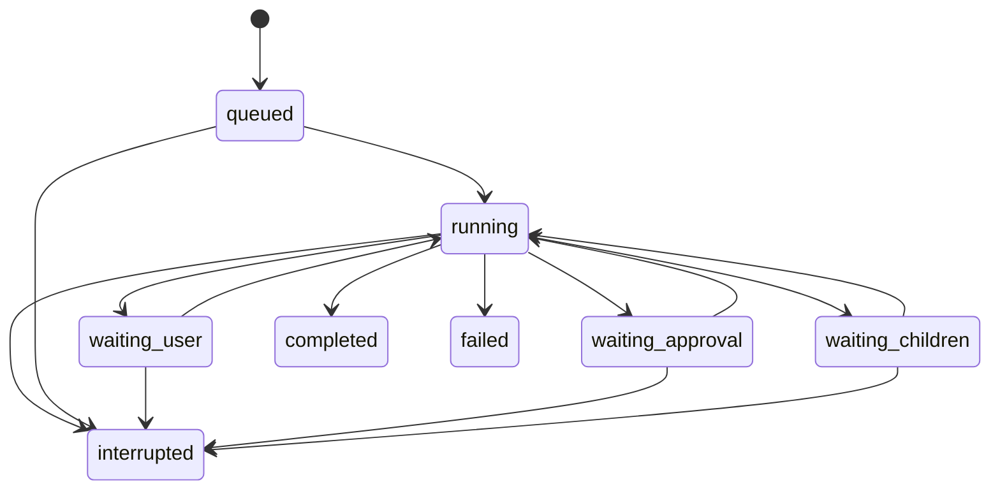

# Architecture

## Boundaries

- `shared/`: domain and wire types.
- `server/core/`: lifecycle, model concurrency, orchestration and generic prompts.
- `server/providers/`: protocol-specific serialization, streaming, usage and model discovery. No UI or filesystem execution dependencies.
- `server/tools/`: validated tool registry and capability checks; a tool declaration is separate from its implementation.
- `server/services/`: file access, process execution, approvals, document extraction, retrieval, embeddings, skills and MCP.
- `server/storage/`: SQLite records, ordered events, effects and metering ledger.
- `server/http/`: loopback authenticated API and SSE.
- `src/`: React UI; model credentials never enter public state.
Local invariant, negative-control and integration fixtures are retained in the development workspace and excluded from the public repository.

The runtime receives a model-provider resolver, making it replaceable in tests. Its tool context contains explicit service ports. Provider-specific reasoning blocks live in model messages, not tool execution code. Subagents reuse the same runtime and shared model pool; they do not create a second orchestration engine.

## Run lifecycle

Terminal runs are immutable lifecycle endpoints. Continuing creates a new run using the last durable context. A service restart never resumes model or tool work automatically.

## Ordered evidence

User messages, assistant messages, tool starts/results, approvals, usage and status changes are persisted as ordered events. Token deltas are ephemeral for efficient streaming; finalized text is durable. An interrupted partial answer is saved with an incomplete marker.

Side-effect intent is recorded before file writes and commands. Completion is recorded afterwards. Missing results remain unknown. The UI requires an inspection note before starting another run, instead of replaying an uncertain command.

This does not provide distributed exactly-once execution. A process can fail between a tool's real effect and its durable result. The ledger exposes that ambiguity.

## Context and delegation

Compaction summarizes complete historical message groups while keeping recent tool-call/result pairs intact. The threshold is a conservative character estimate, not a tokenizer claim. Usage is metered for compaction requests too.

Children receive a narrow task and deliverable, project facts, selected skills and authorized knowledge scopes. They do not inherit the complete author transcript. Read-only workers remain the default. Writable workers get isolated folder copies and require explicit versioned integration; child commands require an OS isolation backend and external MCP remains disabled. Wait cycles are rejected; cancellation follows descendants.

The parent cannot become terminal with live direct children. Model concurrency is enforced at request admission, including resumed and compaction requests.

## Extension points and remaining work

Use the provider interface for additional protocols, the tool registry for capabilities, and dedicated services for infrastructure. Do not add provider-specific branches to the tool loop.

AppContainer adapters, isolated writable copies and worker-based HNSW are described in MIGRATION.md. Remaining work includes persistent/calibrated ANN artifacts, stronger migration/versioning, OS-backed credential storage and comparative unseen-task evaluation.
